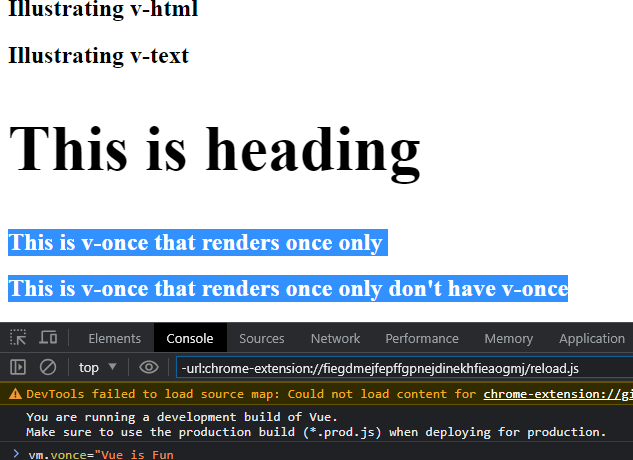

Hello  developers here  is my second journey into this wonderland of vue.js .It is an awesome journey first let me point out why i like vue even if am just a beginner .Here are some of my points:-
        <ul>
        <li>Vue keeps the html same no knew syntax or concept introduced</li>
        <li>Vue  is declarative in terms of you just describe your output and Vue just does the other work</li>
        <li>Lastly  it is easy to maintain.Or let me say at this level  this why i love it .</li>
        </ul>
So on this Second tour on the wonderland (***vue***) i got to explore not much but the core basics so  here it is:-
        <ol>
        <li>Instantaniating a Vue app using CDNs</li>
        <li>data  function</li>
        <li>Interpolation</li>
        <li>Vue Directives</li>
        <li>Conditional rendering</li>
        <li>ref and $ref</li>
        </ol>
<h2>Creating a vue app using CDN </h2>
There  is  3 type of CDNs to use vue   with:-

1.unpkg which i will use over  here  below it is the script:-
<code>

    

</code>
2.jsdelivr
<code>

     //link to the cdn
                
        </body>
        </html>

</code>

This
 <code> div it is used by vue to control our app by vue it doesn't need to be a div it can be any html tag .This is also  the the same for the id it can be a class but recomended to use  id because it is unique

    

  
 </code>

After this under the script tag we can start creating our app like before
<code>

    

</code>

The code above by doing so you will have started an vue app and we can start manupilating our website.

The  Vue in the code is an object that has function createApp that it argument it is an object and in that object  it is where we will control our vue website.let start.

<h3>The data function</h3>
The data function is one of the values of our object of createApp function
The data function it is a function that just returns an object and it must be an object and in it what we return can be used as output in our website let the fun begin:
In this funtion we wan return anything but keynote is that <b>The name of the function must be data which it is a reserved word in vue</b>

So in our script let start out putting:-
    As i said before we can return anything json,object,array,numbers,strings anything but not functions.

<code>

    
    

</code>

As illustrated above you can see multiple data  types. The above code i will use it to illustrate the other parts.

<h2>Interpolation</h2>
This is the folowing this is outputtting data on the website using Mustachetag or this `{{}}`
example took the part of it .

<code>

    

        <h2>`{{ title }}`</h2>

    

    
        

</code>
Here it is the output.

<figcaption>Fig.1.Image for interpolation</figcaption>
Above it is interpolation   or using Mustachetag to display

<h2>Vue directives </h2>
Below it is a list of vue directive
<ol>
<li>v-html</li>
<li>v-for</li>
<li>v-model</li>
<li>v-text</li>
<li>v-if,v-else-if,v-else</li>
<li>v-on</li>
<li>v-cloak</li>
<li>v-bind</li>
<li>v-once</li>
<li>v-is</li>
<li>v-show</li>
</ol>
The list is some of v-directive there is also custom v-directives
What is a v-directive composed of
<code>

        v-dir_name:v-attr="v-argument"

</code>

<h4>1.v-html</h4>
This directive gives you ability to output html code in vue but not recomended since it introduces xss vulnerability

<code>

      

        <h2>`{{ title }}`</h2>
        <h1>`{{ html }}`</h1>
    

    
    

</code>
Here it is output of the above code 

As output showing it can't compile the  html.below is how //v-html is used
<code>

     

        <h2>`{{ title }}`</h2>
        <h1 v-html="html"></h1>
    

    
    
</code>
Output below  as it shows now the  code was compile as a html code remember don't use it occasionally.

<h4>2.v-text</h4>
This v-directive is the same as interpolation or the Mustachetag
<code>

   
    

        <h2>`{{ title }}`</h2>
        <h2  v-text="text"></h2>
        <h1 v-html="html"></h1>
    

    
    

</code>

The result for this snippet is as below
 The selected is the output for the v-text

<h4>3.v-once</h4>
This directive will just render an element just once.And note to take is that the v-once doesn't require a v-attribute and v-argument as shown below

<code>

          <h2>`{{ title }}`</h2>
        <h2  v-text="text"></h2>
        <h1 v-html="html"></h1>
        <h2 v-once  v-text="vonce"></h2>
        <h2>`{{ vonce}}` don't have v-once</h2>
    

    
    
    
</code>
Lets focus on this snippet of part of above snippet
<code>

     <a v-bind:href="link" target="_blank">My linked in profile</a>
         
        <a :href="link" target="_blank">My linked in profile</a>
</code>
Using v-bind  or : for shorthand we can pass link value that is data value of vue to our anchor tag  as  shown below

As the image above illustrate  we can have passed  this <i>https://www.linkedin.com/in/kelvingithu/</i> to the href attribute .
The v-bind or : can be used to pass or bind vue data to any html attribute that needs an argument eg src,href,classes,ids and many more.

<h4>6.v-on</h4>
To illustrate this well will be on the methods since v-on is an event listener like <b>click,mouseover,input and many more</b>  it has a shorthand for @ .<b>@</b> is it's shorthand
<h4>7.v-is</h4>
This  changes a HTML tag from one to another it is working but it is deprecated as of vue 3.1
example:-
<code>

    

        <h2 v-is="`p`">`{{ title }}`</h2>
    

</code>

As image above shows the h2 was changed to p tag.

<h4>8.v-model</h4>
Another important directive must know.
It creates two way data  binding to collect and display the output to the user through the input tag. More understanding is when taking user inputs
<code>

    

    <input type="text" v-model="username">
    
    

    
    
</code>

The above code if user enters any value that value can be accessible in dat in vue in username also it is the same if there is value in username it will be accesible to the user that is two way data binding.

<h4>9.v-for</h4>
This for printing arrays and object to our DOM.
<code>

       

        <!-- v-for  in array -->
        <h2 style="color:#ad0889e3">`{{title}}`</h2>
        
v-for in array

       <ul >
        <li v-for="(elem,index) in cities" :key="index" :ref="`li`+index">
            `{{elem}}`
        </li>
       </ul>
       <!-- v-for in objects -->
       
v-for in object

       <ul>
        <li v-for="(val,prop,index) in car" :key="index" >
            `{{index}}` `{{prop}}` `{{val}}`

        </li>
       </ul>
         <!-- v-for in json -->
            
v-for in json

            <ul>
                <li v-for="(elem,index) in json" :key="index">
                    `{{index}}` `{{elem.Brand}}` `{{elem.model}}` `{{elem.year}}`
                </li>
            </ul>

            <!-- v-for if the json has diferrrent values -->
            <ul v-for="(elem,index) in cars" :key="index">
                <li v-for="(val,prop,index) in elem" :key="idex">
                    `{{prop}}`:`{{val}}`
                </li>
            </ul>

    

    
    

</code>
The output for the code

<h2>10.Conditional Rendering</h2>
conditional rendering use v-directive of v-if ,v-else-if and v-else.
Note to take home is that when using this directive they should be adjancent to each other and no other elements should appear  between them or else it will not work.
Example:-
<code>

      

        
This an Even number

        
This is an odd number

        
This a banana

        
This an apple

        
This is another fruit

    

    
    

</code>

Lets start with  this code block

<code>

    
This an Even number

    
This is an odd number
    
</code>
The code block above we pass val data from vue that is true.we could have passed it directly but the reason behind this is :-
    1.To show we can pass vue data
    2.To change the value to see the conditional rendering
Lets see the output :-
image below is when we compile our code since val is true will print first p tag with This is an even number

Now lets change the value of val to false in the console here it is the output:-it will print second tag with This an odd number

lets inspect the second block which have v-if,v-else-if,v-else:-
The purpose of this is to show we can do simple js code in these v-directives to compare
<code>

      
This a banana

        
This an apple

        
This is another fruit

</code>
Here it is the output:-

As fruit is set to banana it will output This is a banana.

When we change the value of the fruit to apple in the console the output will be This is an apple

When we change the value of the fruit to another fruit lets say kiwi in the console the output will be This is an another fruit

Another keynote to add is that in v-if,v-else-if,v-else it completely removes the element from DOM .

<h4>11.v-show</h4>
This v-directive adds a styling of display:none to the element it  doesn't remove the element form the DOM. If false else if the argument returns true it removes the styling
<code>

       
This will not show

    

    
    

</code>

As the image below  shows 
 

it adds the styling of display none to our paragraph.That is how v-show  works.

<h2>ref and $refs </h2>

ref and $ref works like ids but in more use case it can be illustrated by using child component passing them to parent component and retrieving them.

<code>

     

        <h2 ref="title"  v-if="control" id='title'>`{{title}}`</h2>
        
`{{msg}}`

    

    
    <script>
        const app = Vue.createApp({
            data(){
                return{
                    title:"Ref Attribute & vm.$refs",
                    msg:"access page elem. $ child comp",
                    control:true
                }
            }
        
        })
            let vm = app.mount("#app")
            let  h2 = vm.$refs.title
</code>
$refs-> This is vue keyword  that has all ref
ref-> we create ref as shown in the code below we use <i>ref="any value"</i>

<code>

    <h2 ref="title"  v-if="control" id='title'>`{{title}}`</h2>
        
`{{msg}}`

</code>

Images below we can see that we have access or we have or p and h2

This image below we can even console the whole tag with it value

<b><i>Happy Developing .Bug free Codes😎😋</i></b>
<h3>Next stage is <strong>Computed, Methods, and Handling Forms</strong></h3>
